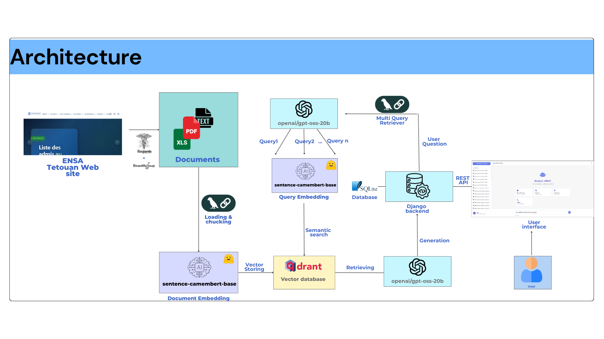

# ENSA Chatbot

<div align="center">

## Built With

[](https://www.python.org/)
[](https://www.djangoproject.com/)
[](https://www.langchain.com/)
[](https://huggingface.co/)
[](https://huggingface.co/docs/transformers)
[](https://qdrant.tech/)
[](https://www.sbert.net/)
[](https://numpy.org/)
[](https://groq.com/)

</div>

An intelligent chatbot application for ENSA (École Nationale des Sciences Appliquées) built with Django, RAG (Retrieval-Augmented Generation), and modern AI technologies.

---

## Overview

ENSA Chatbot is a web-based conversational assistant that helps students and staff access institutional information such as schedules, exams, courses, and general ENSA data.  
It leverages semantic search with vector embeddings and LLM-based response generation to provide accurate, context-aware answers.

---

## Key Features

### Authentication & User Management
- User registration, login, and secure password management  
- Personalized profile with chat statistics  

### Chatbot Interface
- Modern chat UI inspired by ChatGPT  
- Real-time message streaming  
- Typing indicator and character counter (max 2000)  
- Persistent chat history  

### RAG (Retrieval-Augmented Generation)
- Document chunking with 512-token control  
- Semantic search using sentence embeddings  
- Vector storage with Qdrant  
- Source citation in responses  

### Admin Dashboard
- Manage users and system usage  
- View chat history and statistics  

---

## Architecture



---

## Project Structure
```bash
ensa_chatbot/
├── manage.py
├── ensa_chatbot/
│   ├── __init__.py
│   ├── settings.py
│   ├── urls.py
│   └── wsgi.py
├── chat_app/
│   ├── __init__.py
│   ├── admin.py
│   ├── apps.py
│   ├── models.py
│   ├── views.py
│   ├── urls.py
│   ├── utils.py
│   ├── management/
│   │   └── commands/
│   │       ├── list_users.py
│   │       ├── change_password.py
│   │       └── create_demo_users.py
│   └── templatetags/
│       ├── __init__.py
│       └── custom_filters.py
├── templates/
│   └── chatbot/
│       ├── landing.html
│       ├── login.html
│       ├── signup.html
│       ├── chatbot.html
│       ├── profile.html
│       └── history.html
├── static/
│   ├── css/
│   │   ├── style.css
│   │   └── modern-chat.css
│   └── js/
│       └── modern-chat.js
├── data/
│   ├── data_final/
│   │   ├── emploi-temps/
│   │   └── [other data folders]
│   └── brut_data/
│       └── ...
├── requirements.txt
└── .env
```

---

## Technologies

Backend: Django, Python 3, Qdrant, HuggingFace, Groq API  
Frontend: HTML5, CSS3, JavaScript (ES6+), Font Awesome  
NLP: CamemBERT embeddings (768 dimensions), HNSW search, cosine similarity  
Infrastructure: Docker (for Qdrant), SQLite, environment variables with dotenv  

---

## Installation

### Prerequisites
- Python 3  
- Docker  
- Git

### Steps
```bash
# Clone repository
git clone https://github.com/yourusername/ensa-chatbot.git
cd ensa-chatbot

# Create virtual environment
python -m venv .venv
.venv\Scripts\activate   # Windows
# or
source .venv/bin/activate   # Linux/Mac

# Install dependencies
pip install -r requirements.txt

```

### Environment Variables

Create a .env file in the project root with the following content:

```bash
DJANGO_SECRET_KEY=your-secret-key
DEBUG=True
HUGGINGFACE_TOKEN=your_huggingface_token
groq_api=your_groq_api_key

# Qdrant Configuration
QDRANT_USE_CLOUD=True # True to store in cloud

# Qdrant Cloud (when USE_CLOUD=True)
QDRANT_URL=your_qdrant_cloud_url:6333
QDRANT_API_KEY=youre_qdrant_cloud_api

# Local Qdrant (when USE_CLOUD=False)
QDRANT_HOST=localhost
QDRANT_PORT=6333
```

### Start Qdrant

```bash
# to run local qdrant on local within Docker
docker run -d -p 6333:6333 -p 6334:6334 --name qdrant qdrant/qdrant
```

### Database Setup
```bash
python manage.py migrate
python manage.py createsuperuser
```

### Run the Application
```bash
python manage.py runserver
```

Visit: http://127.0.0.1:8000

### Management Commands
```bash
python manage.py list_users
python manage.py change_password <username> <new_password>
python manage.py create_demo_users
```

## Contributing
1. Fork this repository
2. Create a new feature branch
3. Commit and push your changes
4. Open a Pull Request
5. Contributions and suggestions are welcome.

## Future Perspectives
The next planned development phase includes:
* Fine-tuning the mistralai/Mistral-7B-Instruct-v0.2 model
* Using a custom fine-tuning dataset based on ENSA-specific academic content
* Integrating the fine-tuned model into the chatbot pipeline
* Improving context retention and reasoning capabilities
* Expanding the dataset with multilingual content (Arabic, French, English)
  
## Demonstration
Check out the full demo video below:
[](https://www.youtube.com/watch?v=9IU4lGGpRJg)
*Click the image above to watch the 3-minute demo on YouTube*

## License
This project is licensed under the **MIT License (Attribution Required)**, see the [LICENSE](./LICENSE) file for details.
If you use this project (in whole or in part), please include the following credit:
"Original work by Hamza Kholti (https://github.com/Elkholtihm/)"

